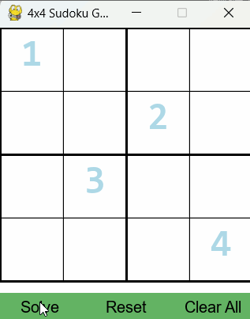
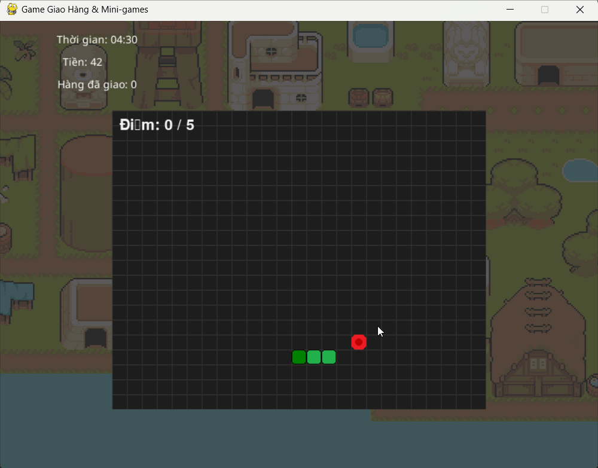
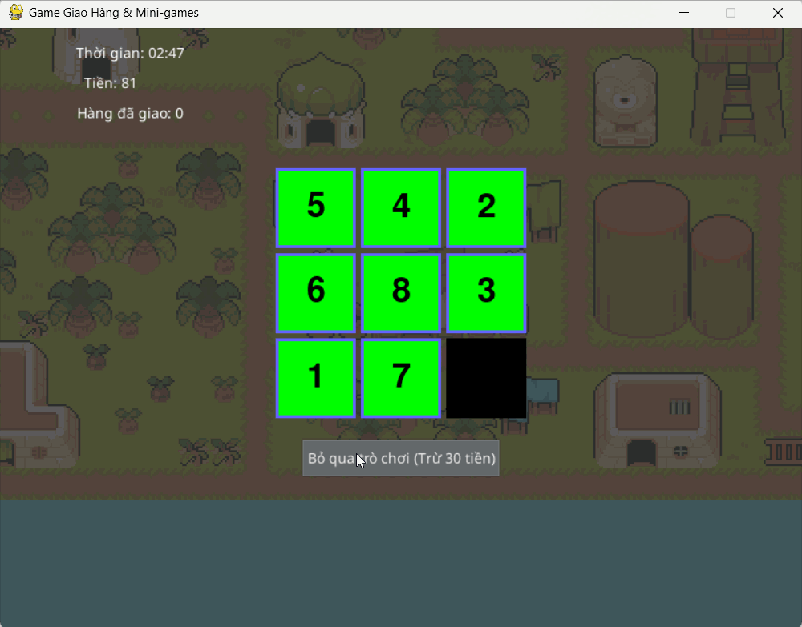
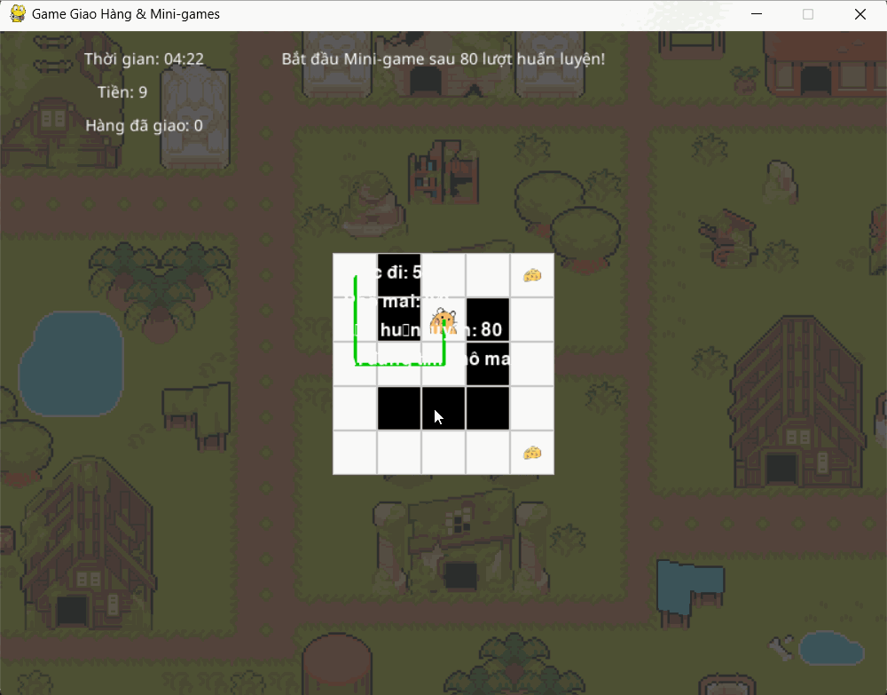
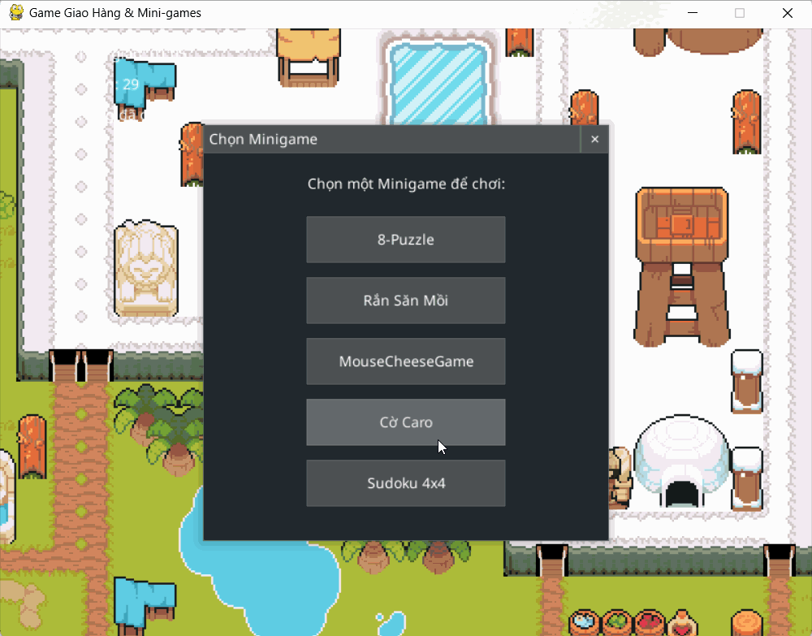

## Khám Phá Thế Giới Game Sống Động! 🚀

Chào mừng bạn đến với cuộc phiêu lưu giao hàng 2D đầy hấp dẫn! Hãy cùng dạo một vòng qua những điểm nổi bật và các thử thách thuật toán mà bạn sẽ đối mặt trong thế giới game của chúng tôi:

**1. Phiêu Lưu Trong Thế Giới Mở Rộng Lớn:**
Du hành tự do qua các khu vực được thiết kế tỉ mỉ từ file CSV, thực hiện các nhiệm vụ giao hàng đầy thử thách và quản lý tài chính cá nhân. Mỗi chuyến đi là một khám phá mới!


**2. "Taxi" AI Dẫn Lối Thông Minh:**
Bạn cần đến một địa điểm cụ thể mà không muốn tự mình tìm đường? Tính năng "Taxi" sử dụng các thuật toán tìm đường như Backtracking (cùng với A\*, Beam Search) sẽ giúp bạn di chuyển tự động một cách nhanh chóng (có tính một khoản phí nhỏ!).


**3. Đấu Trí Cùng Chuỗi Mini-Games Đa Dạng:**
Không chỉ giao hàng, bạn còn có cơ hội rèn luyện tư duy và tìm hiểu về các thuật toán thông qua các mini-game độc đáo được tích hợp:

* **Rắn Săn Mồi (Snake Game) Kinh Điển:** Điều khiển chú rắn của bạn thu thập mồi, tránh các chướng ngại vật và chính chiếc đuôi dài của mình. Cẩn thận kẻo bị phạt tiền khi va chạm!
    

* **Giải Đố 8-Puzzle Hóc Búa:** Thử thách khả năng sắp xếp logic của bạn với trò chơi 8-Puzzle. Nếu quá khó, bạn có thể sử dụng AI (thuật toán UCS) để giải giúp với một chi phí nhất định.
    

* **Chuột Thông Minh Tìm Phô Mai (Mouse & Cheese Maze):** Quan sát AI (sử dụng Q-Learning) điều khiển chú chuột khéo léo tìm đường trong mê cung phức tạp để đến được miếng phô mai thơm ngon. Bạn thậm chí có thể "huấn luyện" AI bằng cách trả phí!
    

* **Cờ Caro Chiến Thuật (Caro Game):** Thử tài đấu trí cùng AI trong những ván cờ Caro căng thẳng, sử dụng các thuật toán như Minimax để thách thức người chơi.
    

Hãy sẵn sàng để chinh phục mọi nhiệm vụ giao hàng, khám phá thế giới rộng lớn và vượt qua các thử thách thuật toán thú vị! Chi tiết về các tính năng khác của trò chơi đang chờ bạn ở phần tiếp theo.
## Tính năng

### Game chính:
* **Thế giới mở:** Di chuyển tự do trên bản đồ lớn được thiết kế từ file CSV.
* **Nhiệm vụ giao hàng:** Thu thập các "điểm" (items/points) trên bản đồ.
* **Hệ thống kinh tế:** Người chơi có tiền, có thể kiếm thêm hoặc bị trừ khi tương tác với các yếu tố trong game (ví dụ: giải AI cho puzzle, phạt khi thua mini-game).
* **Thời gian giới hạn:** Hoàn thành mục tiêu trước khi hết giờ.
* **Camera:** Theo dõi người chơi, tạo cảm giác khám phá.
* **Pathfinding "Taxi":** Người chơi có thể sử dụng thuật toán tìm đường (A\*, Beam Search, Backtracking) để di chuyển tự động đến một điểm đã chọn (có tính phí).
* **Giao diện người dùng:** Sử dụng `pygame_gui` để hiển thị thông tin (thời gian, tiền, vật phẩm) và các cửa sổ tương tác.

### Mini-games tích hợp:
* **8-Puzzle:** Giải đố trí tuệ sắp xếp các ô số. Có tùy chọn cho AI giải tự động (UCS) với một khoản phí.
* **Rắn Săn Mồi (Snake Game):** Điều khiển rắn ăn mồi, tránh tường và thân mình. Có thể bị phạt tiền khi va chạm.
* **Chuột và Phô Mát (Mouse & Cheese Maze):** AI (Q-Learning) điều khiển chuột tìm đường trong mê cung để ăn phô mai. Người chơi có thể "huấn luyện" AI bằng cách trả phí.
* **Cờ Caro (Caro Game):** Đánh cờ caro với AI (sử dụng Minimax hoặc các thuật toán khác).
* **Cửa sổ chọn Mini-game:** Cho phép người chơi chọn mini-game muốn thử thách khi đến các điểm đặc biệt.

## Công nghệ sử dụng
* **Ngôn ngữ:** Python 3.x
* **Thư viện chính:** Pygame
* **Giao diện người dùng:** Pygame GUI
* **Khác:** `numpy` (có thể được sử dụng trong một số thuật toán AI), `csv` (đọc dữ liệu bản đồ).

## Cài đặt

1.  **Clone repository:**
    ```bash
    git clone https://github.com/Tai1337/Pygame-algorithm.git


2.  **Tạo môi trường ảo (khuyến khích):**
    ```bash
    python -m venv venv
    # Windows
    venv\Scripts\activate
    # macOS/Linux
    source venv/bin/activate
    ```

3.  **Cài đặt các thư viện cần thiết:**
 
    pygame
    pygame_gui
    numpy 
    

## Cách chạy trò chơi

Sau khi cài đặt, chạy file `main.py` từ thư mục gốc của dự án:
```bash
python main.py
